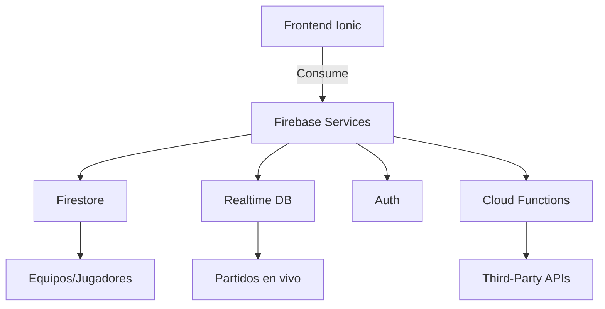

# ⚽ Cracks-App - Gestión Integral de Torneos de Fútbol

---

## 📋 Descripción General

**Cracks-App** es una aplicación móvil diseñada para organizar y gestionar torneos de fútbol amateur/profesional.  
Permite administrar **equipos**, **jugadores**, **partidos**, **calendarios** y **tablas de posiciones**,  
ofreciendo una solución todo-en-uno para coordinadores, árbitros y jugadores.

---

## 🚀 Características Principales

### 🏆 Gestión de Torneos
- Creación de torneos personalizados  
- Configuración de reglas y formatos de competencia  
- Asignación de categorías y grupos

### 👥 Gestión de Equipos
- Registro de equipos con escudos y colores  
- Plantilla de jugadores por equipo  
- Estadísticas colectivas

### ⚽ Gestión de Jugadores
- Fichas técnicas con datos personales y posición  
- Historial de goles, tarjetas y rendimiento  
- Foto y datos de contacto

### 📅 Calendario de Partidos
- Programación automática/manual de encuentros  
- Notificaciones de partidos próximos  
- Sincronización con calendarios externos

### 📊 Tablas de Posiciones
- Cálculo automático de puntuaciones  
- Sistemas de desempate configurables  
- Visualización de estadísticas por equipo/jugador

### 🎯 En Vivo
- Seguimiento de marcadores en tiempo real  
- Carga de eventos (goles, amonestaciones)  
- Reportes post-partido

---

## 🛠 Tecnologías Utilizadas

| Frontend         | Backend          | Autenticación | Base de Datos  | 
| ---------------- | ---------------- | ------------- | -------------- |
| Ionic + Angular  | Firebase         | Firebase Auth | Firestore      |
| TypeScript       | Cloud Functions  |               | Realtime DB    |

---

## 🗂 Estructura del Proyecto

```bash
src/
├── assets/               # Recursos estáticos (logos, iconos)
├── app/                  # Configuración principal
├── auth/                 # Autenticación
├── components/           # Componentes reutilizables
├── pages/                # Vistas principales
│   ├── tournaments/      # Gestión de torneos
│   ├── teams/            # Gestión de equipos
│   ├── players/          # Gestión de jugadores
│   ├── matches/          # Partidos y calendario
│   └── standings/        # Tablas de posición
└── services/             # Lógica de Firebase
```

## 🏗 Arquitectura del Sistema



## 🔷 Capas Principales

##### Frontend (Ionic + Angular)

Componentes reutilizables

Gestión de estado con RxJS

Diseño responsive con Ionic Components

##### Backend (Firebase)

Firestore: Datos estructurados (torneos, equipos)

Realtime DB: Sincronización en vivo de partidos

Cloud Functions: Lógica de negocio y triggers

##### Integraciones

Google Calendar API (Sincronización)

OneSignal (Notificaciones push)

## 🤖 Configuración

```bash
# Clonar repositorio
git clone https://github.com/GabooMedina/Cracks-AppMovil.git
cd Cracks-App

# Instalar dependencias
npm install

# Ejecutar en navegador (modo desarrollo)
ionic serve

# Ejecutar en dispositivo Android
ionic cap run android

# Construir para producción
ionic build --prod
```

## 📋 Requisitos del Sistema:

Node.js 18+

Ionic CLI 6+

Capacitor (para builds nativos)

Cuenta Firebase configurada

## 👤 Autor
Gabriel Medina